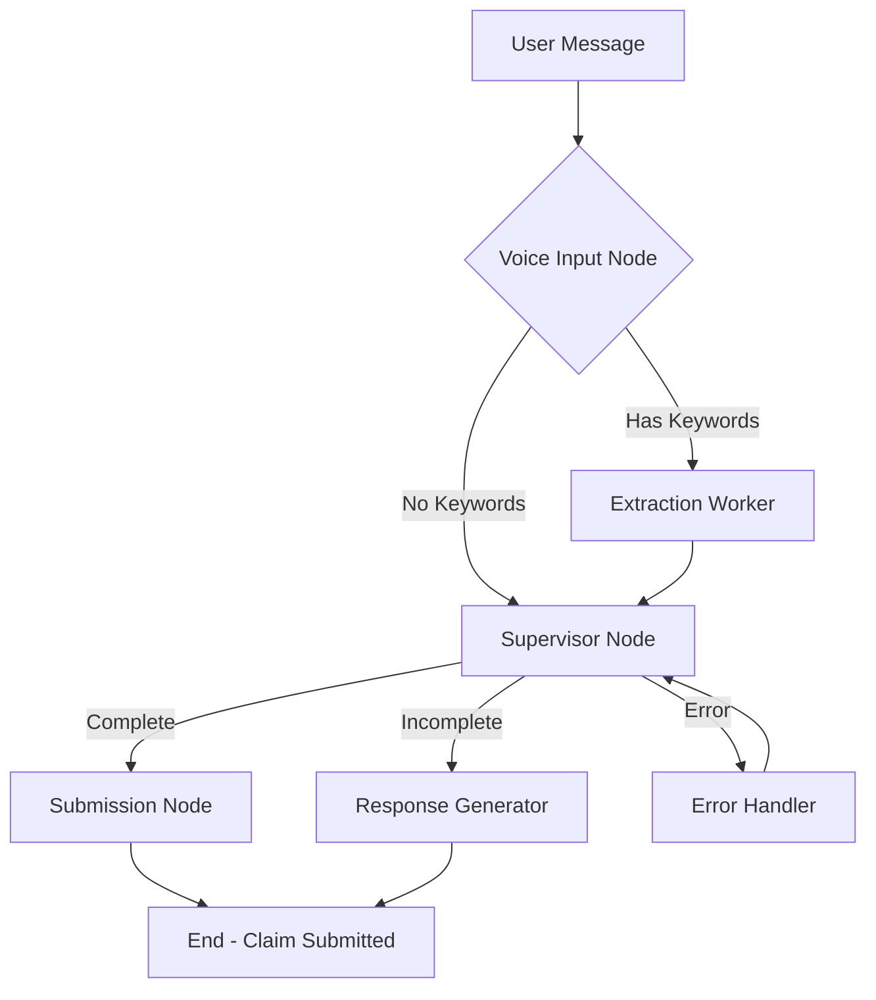

# FNOL Voice Agent - Architecture Diagram

Visual representation of the complete application architecture.

## 🎨 High-Level Architecture

```
┌─────────────────────────────────────────────────────────────────────┐
│                                                                      │
│                         USER BROWSER                                 │
│                                                                      │
│  ┌────────────────────────────────────────────────────────────┐   │
│  │                    React Frontend                           │   │
│  │                  (localhost:3000)                           │   │
│  │                                                             │   │
│  │  ┌──────────┐  ┌──────────┐  ┌──────────┐  ┌──────────┐  │   │
│  │  │  Header  │  │ Call Btn │  │   Chat   │  │   JSON   │  │   │
│  │  │ + Logo   │  │  (Red)   │  │ History  │  │ Payload  │  │   │
│  │  └──────────┘  └──────────┘  └──────────┘  └──────────┘  │   │
│  │                                                             │   │
│  │  ┌─────────────────────────────────────────────────────┐  │   │
│  │  │         useVoiceAgent Hook                          │  │   │
│  │  │  - WebSocket Manager                                │  │   │
│  │  │  - Audio Capture/Playback                           │  │   │
│  │  │  - State Management                                 │  │   │
│  │  └─────────────────────────────────────────────────────┘  │   │
│  └────────────┬─────────────────────────────┬────────────────┘   │
│               │                             │                     │
│               │ WebSocket                   │ Audio               │
│               │ JSON Messages               │ PCM16 24kHz         │
└───────────────┼─────────────────────────────┼─────────────────────┘
                │                             │
                ↓                             ↑
┌─────────────────────────────────────────────────────────────────────┐
│                                                                      │
│                    FastAPI Backend Server                            │
│                      (localhost:8000)                                │
│                                                                      │
│  ┌────────────────────────────────────────────────────────────┐   │
│  │              VoiceSessionManager                            │   │
│  │                                                             │   │
│  │  ┌─────────────────────────────────────────────────────┐  │   │
│  │  │  WebSocket Handler                                  │  │   │
│  │  │  - Accepts client connections                       │  │   │
│  │  │  - Routes messages                                  │  │   │
│  │  │  - Manages session state                            │  │   │
│  │  └─────────────────────────────────────────────────────┘  │   │
│  │                                                             │   │
│  │  ┌─────────────────────────────────────────────────────┐  │   │
│  │  │  Realtime API Manager                               │  │   │
│  │  │  - Connects to Azure OpenAI                         │  │   │
│  │  │  - Forwards audio streams                           │  │   │
│  │  │  - Receives transcriptions                          │  │   │
│  │  └─────────────────────────────────────────────────────┘  │   │
│  │                                                             │   │
│  │  ┌─────────────────────────────────────────────────────┐  │   │
│  │  │  LangGraph Integration                              │  │   │
│  │  │  - Imports default_graph                            │  │   │
│  │  │  - Creates VoiceAgentState                          │  │   │
│  │  │  - Invokes workflow                                 │  │   │
│  │  │  - Processes results                                │  │   │
│  │  └─────────────────────────────────────────────────────┘  │   │
│  └────────────┬─────────────────────────────┬────────────────┘   │
│               │                             │                     │
└───────────────┼─────────────────────────────┼─────────────────────┘
                │                             │
                │ WebSocket                   │ WebSocket
                │ (Realtime API)              │ (LangGraph)
                ↓                             ↓
┌─────────────────────────────┐  ┌──────────────────────────────────┐
│  Azure OpenAI Realtime API  │  │    voice_langgraph Package       │
│                             │  │      (Existing - Unmodified)     │
│  ├─ Whisper (ASR)          │  │                                  │
│  ├─ GPT-4o Realtime        │  │  ┌────────────────────────────┐ │
│  ├─ TTS (24kHz)            │  │  │   LangGraph Workflow       │ │
│  └─ Server VAD             │  │  │                            │ │
│                             │  │  │  ┌──────────────────────┐ │ │
└─────────────────────────────┘  │  │  │  Voice Input Node    │ │ │
                                  │  │  │  (keyword detect)    │ │ │
                                  │  │  └──────────┬───────────┘ │ │
                                  │  │             ↓             │ │
                                  │  │  ┌──────────────────────┐ │ │
                                  │  │  │ Extraction Worker    │ │ │
                                  │  │  │ (Trustcall)          │ │ │
                                  │  │  └──────────┬───────────┘ │ │
                                  │  │             ↓             │ │
                                  │  │  ┌──────────────────────┐ │ │
                                  │  │  │  Supervisor Node     │ │ │
                                  │  │  │  (orchestration)     │ │ │
                                  │  │  └──────────┬───────────┘ │ │
                                  │  │             ↓             │ │
                                  │  │  ┌──────────────────────┐ │ │
                                  │  │  │ Response Generator   │ │ │
                                  │  │  │ (natural language)   │ │ │
                                  │  │  └──────────────────────┘ │ │
                                  │  │                            │ │
                                  │  └────────────────────────────┘ │
                                  │                                  │
                                  │  Uses:                           │
                                  │  - PropertyClaim schema          │
                                  │  - VoiceAgentState              │
                                  │  - Prompts                      │
                                  │  - Settings                     │
                                  │                                  │
                                  └──────────────────────────────────┘
```

## 🔄 Data Flow Sequence

### 1️⃣ Session Initialization

```
User clicks "Call Agent"
    │
    ├─► Frontend: initializeAudio()
    │     └─► Request microphone access
    │
    ├─► Frontend: connectWebSocket()
    │     └─► Connect to ws://localhost:8000/ws/voice
    │
    └─► Frontend → Backend: { type: "start_session" }
          │
          └─► Backend: start_realtime_connection()
                │
                └─► Connect to Azure OpenAI Realtime API
                      │
                      └─► Send session configuration
                            │
                            └─► Backend → Frontend: { type: "agent_ready" }
```

### 2️⃣ User Speech Processing

```
User speaks into microphone
    │
    ├─► Web Audio API captures audio
    │
    ├─► AudioWorklet processes to PCM16
    │     └─► Convert Float32 → Int16
    │
    ├─► Base64 encode
    │
    └─► Frontend → Backend: { type: "audio_data", audio: "..." }
          │
          └─► Backend → Azure: { type: "input_audio_buffer.append" }
                │
                └─► Azure: VAD detects speech end
                      │
                      └─► Azure → Backend: { type: "transcription.completed" }
                            │
                            ├─► Backend → Frontend: 
                            │     { type: "chat_message", role: "user", content: "..." }
                            │
                            └─► Backend: run_langgraph_workflow(transcript)
```

### 3️⃣ LangGraph Processing

```
Backend invokes default_graph.ainvoke(state)
    │
    ├─► Voice Input Node
    │     └─► Detect extraction keywords → next_action: "extract"
    │
    ├─► Extraction Worker Node
    │     └─► Trustcall extraction
    │           └─► Extract claim data from conversation
    │                 └─► Update claim_data in state
    │
    ├─► Supervisor Node
    │     └─► Validate completeness
    │           ├─► PropertyClaim.is_complete()
    │           └─► Generate next response
    │
    └─► Response Generator Node (if needed)
          └─► Create natural language response
                │
                └─► Return updated state
                      │
                      └─► Backend processes result
```

### 4️⃣ Response Delivery

```
Backend receives LangGraph result
    │
    ├─► If claim_data changed:
    │     └─► Backend → Frontend: 
    │           { type: "claim_data_update", 
    │             data: { claim_data: {...}, is_complete: false } }
    │
    ├─► If claim complete:
    │     └─► Backend → Frontend:
    │           { type: "claim_complete",
    │             data: { claim_data: {...}, submission_result: {...} } }
    │
    └─► Send response to Realtime API:
          │
          └─► Azure generates speech
                │
                └─► Azure → Backend: { type: "audio_delta", audio: "..." }
                      │
                      ├─► Backend → Frontend: { type: "audio_delta", ... }
                      │     └─► Frontend plays through AudioWorklet
                      │
                      └─► Azure → Backend: { type: "transcript", text: "..." }
                            │
                            └─► Backend → Frontend:
                                  { type: "chat_message", role: "assistant", ... }
```

### 5️⃣ Frontend UI Update

```
Frontend receives WebSocket message
    │
    ├─► Type: "chat_message"
    │     └─► setMessages([...prev, newMessage])
    │           └─► ChatHistory component re-renders
    │                 └─► Auto-scroll to bottom
    │
    ├─► Type: "claim_data_update"
    │     └─► setClaimData(newData)
    │           └─► JsonPayloadDisplay component re-renders
    │                 ├─► Update JSON display
    │                 ├─► Recalculate progress bar
    │                 └─► Update completion status
    │
    └─► Type: "audio_delta"
          └─► playbackWorklet.port.postMessage({ audio: data })
                └─► AudioWorklet plays audio through speakers
```

## 🔌 WebSocket Protocol

### Message Exchange Pattern

```
Client ←→ Server Communication

Client → Server:
├─ start_session         → Initiates agent connection
├─ audio_data (repeated) → Microphone audio stream
└─ stop_session          → Ends session

Server → Client:
├─ connected            → Connection established
├─ agent_ready          → Ready to listen
├─ chat_message         → Transcription update
├─ claim_data_update    → JSON payload update
├─ audio_delta          → Agent speech audio
├─ claim_complete       → Claim submitted
└─ error                → Error occurred
```

## 🏗️ Component Hierarchy

### Frontend Component Tree

```
App
├── Header
│   └── Logo (intactbot_logo.png)
│
├── StatusIndicator
│   ├── Connection status dot
│   └── Session status text
│
├── CallAgentButton
│   ├── Start session (red button)
│   └── End session (gray button)
│
├── Error Display (conditional)
│   └── Error message banner
│
└── Main Grid Layout
    ├── ChatHistory (left panel)
    │   ├── Empty state
    │   └── Message list
    │       ├── User message bubbles (gray, right)
    │       └── Agent message bubbles (dark, left)
    │
    └── JsonPayloadDisplay (right panel)
        ├── Header with progress bar
        ├── Collapse button
        └── JSON content
            ├── Empty state
            └── Syntax-highlighted JSON
```

### Backend Architecture

```
FastAPI Application (server.py)
│
├── HTTP Endpoints
│   ├── GET /           → Health check
│   ├── GET /health     → Detailed health status
│   └── GET /api/session/{id} → Session data
│
└── WebSocket Endpoint
    └── WS /ws/voice
        │
        └── VoiceSessionManager (per connection)
            │
            ├── Client Communication
            │   ├── send_to_client()
            │   └── handle_client_message()
            │
            ├── Realtime API Communication
            │   ├── start_realtime_connection()
            │   └── handle_realtime_event()
            │
            └── LangGraph Integration
                └── run_langgraph_workflow()
                    │
                    └── default_graph.ainvoke(state)
```

## 📦 Integration Points

### Backend Imports from voice_langgraph

```python
# Graph and workflow
from voice_langgraph.graph_builder import default_graph

# State management
from voice_langgraph.state import VoiceAgentState, ConversationMessage

# Schema validation
from voice_langgraph.schema import PropertyClaim

# Configuration
from voice_langgraph.settings import voice_settings, validate_voice_settings

# Prompts
from voice_langgraph.prompts import Prompts

# Utilities
from voice_langgraph.utils import (
    get_timestamp,
    WebSocketManager,
    encode_audio,
    decode_audio
)
```

### Frontend Audio Processing Chain

```
Microphone Input
    │
    ├─► MediaStream (getUserMedia)
    │
    ├─► AudioContext (24kHz)
    │
    ├─► MediaStreamSource
    │
    ├─► AudioWorkletNode (audio-processor-worklet)
    │     └─► Convert Float32 to Int16 PCM
    │           └─► Send to main thread
    │
    └─► Main Thread
          └─► Base64 encode
                └─► WebSocket send

Agent Audio Output
    │
    ├─► WebSocket receive
    │
    ├─► Base64 decode
    │
    ├─► Convert to Int16Array
    │
    └─► AudioWorkletNode (audio-playback-worklet)
          └─► Convert Int16 to Float32
                └─► Buffer management
                      └─► AudioContext destination (speakers)
```

## 🎯 State Management

### Frontend State (React useState)

```javascript
const [isConnected, setIsConnected] = useState(false)
const [isSessionActive, setIsSessionActive] = useState(false)
const [messages, setMessages] = useState([])
const [claimData, setClaimData] = useState({})
const [isClaimComplete, setIsClaimComplete] = useState(false)
const [agentStatus, setAgentStatus] = useState('Initializing...')
const [error, setError] = useState(null)
```

### Backend State (per session)

```python
class VoiceSessionManager:
    session_id: str                     # Unique session ID
    conversation_history: List[ConversationMessage]
    current_claim_data: Dict[str, Any]
    current_timezone: str
    is_active: bool
    realtime_ws: Optional[WebSocketManager]
    _greeting_sent: bool
```

### LangGraph State (VoiceAgentState)

```python
VoiceAgentState = {
    "conversation_history": List[ConversationMessage],
    "current_user_message": str,
    "last_assistant_message": str,
    "claim_data": Dict[str, Any],
    "next_action": str,
    "is_claim_complete": bool,
    "submission_result": Optional[Dict],
    "session_id": str,
    "timestamp": str,
    "current_timezone": str,
    "error": Optional[str],
    "retry_count": int
}
```

## 🔀 Workflow Visualization

### LangGraph Workflow Execution



### Frontend Render Flow

```
State Update
    │
    ├─► React reconciliation
    │
    ├─► Component re-render
    │     ├─► ChatHistory
    │     │     └─► Map over messages
    │     │           └─► Render message bubbles
    │     │                 └─► Auto-scroll to bottom
    │     │
    │     └─► JsonPayloadDisplay
    │           ├─► Calculate progress
    │           ├─► Update progress bar
    │           └─► Format JSON
    │                 └─► Syntax highlight
    │
    └─► DOM update (React Fiber)
```

## 🌐 Network Communication

### WebSocket Frame Structure

```
Frontend → Backend:
┌─────────────────────────────────┐
│ WebSocket Frame                 │
├─────────────────────────────────┤
│ Type: Text                      │
│ Payload: JSON                   │
│ {                               │
│   "type": "audio_data",         │
│   "audio": "base64_string..."   │
│ }                               │
└─────────────────────────────────┘

Backend → Frontend:
┌─────────────────────────────────┐
│ WebSocket Frame                 │
├─────────────────────────────────┤
│ Type: Text                      │
│ Payload: JSON                   │
│ {                               │
│   "type": "claim_data_update",  │
│   "data": {...},                │
│   "timestamp": "12:34:56"       │
│ }                               │
└─────────────────────────────────┘
```

## 🎨 UI Layout Dimensions

```
┌────────────────────────────────────────────────────┐
│ Header: 72px height                                │
├────────────────────────────────────────────────────┤
│ Status Bar: 48px height                            │
├────────────────────────────────────────────────────┤
│ Call Button Area: 120px height                     │
├─────────────────────────┬──────────────────────────┤
│ Chat History            │ JSON Payload             │
│ Height: 600px           │ Height: 600px            │
│ Border: 1px gray        │ Border: 1px gray         │
│ Padding: 16px           │ Padding: 16px            │
│ Overflow: auto          │ Overflow: auto           │
└─────────────────────────┴──────────────────────────┘
│ Footer: 80px height                                │
└────────────────────────────────────────────────────┘

Total min-height: 100vh (full viewport)
Responsive: Grid collapses on mobile (<1024px)
```

## 🎨 Color Usage Map

```
Component               Background    Text        Border      Accent
─────────────────────────────────────────────────────────────────────
Header                  White         Black       Gray        -
Status Bar              Gray-50       Gray-700    Gray-200    Green/Red
Call Button (inactive)  Red (#E31937) White       -           Red-700
Call Button (active)    Gray-700      White       -           Gray-800
Chat - User Message     Gray-200      Gray-900    -           -
Chat - Agent Message    Gray-800      White       -           -
JSON Panel              White         Black       Gray-300    -
Progress Bar            Gray-200      -           -           Red/Green
Footer                  White         Gray-500    Gray-200    -
```

---

## 📚 Technology Integration

```
┌─────────────────────────────────────────────────────────────┐
│                     Technology Stack                         │
├─────────────────────────────────────────────────────────────┤
│                                                              │
│  Frontend                                                    │
│  ├─ React 18.2         → UI rendering                       │
│  ├─ Vite 5.0           → Build & dev server                 │
│  ├─ Tailwind CSS 3.3   → Styling                            │
│  ├─ Web Audio API      → Audio I/O                          │
│  └─ WebSocket API      → Real-time comms                    │
│                                                              │
│  Backend                                                     │
│  ├─ Python 3.11        → Runtime                            │
│  ├─ FastAPI 0.104      → Web framework                      │
│  ├─ Uvicorn            → ASGI server                        │
│  ├─ WebSockets 12      → WS handling                        │
│  └─ Asyncio            → Async runtime                      │
│                                                              │
│  Agent (voice_langgraph)                                    │
│  ├─ LangGraph          → Workflow orchestration             │
│  ├─ Trustcall          → JSON extraction                    │
│  ├─ LangChain OpenAI   → LLM integration                    │
│  └─ Pydantic           → Data validation                    │
│                                                              │
│  AI Services                                                 │
│  ├─ Azure OpenAI       → Cloud AI platform                  │
│  ├─ GPT-4o Realtime    → Voice model                        │
│  ├─ GPT-4              → Supervisor LLM                     │
│  └─ Whisper-1          → Speech recognition                 │
│                                                              │
└─────────────────────────────────────────────────────────────┘
```

---

**Last Updated**: September 30, 2025  
**Version**: 1.0.0
