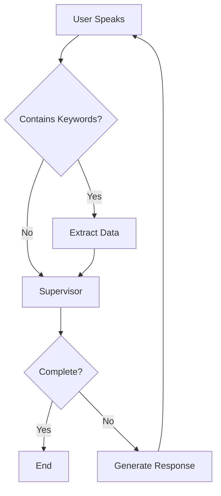

# Voice LangGraph Agent

A modular, efficient voice agent implementation using LangGraph for property insurance claim intake.

## Key Improvements

This implementation addresses the redundancy issues in the original code:

### ✅ No Redundant Trustcall Operations
- **Original**: Trustcall was called twice per user message (background update + supervisor call)
- **New**: Single extraction pass only when needed, based on keyword detection

### ✅ Clean Architecture
- **Modular design** with clear separation of concerns
- **LangGraph workflow** for orchestration
- **Type-safe schemas** for better developer experience

### ✅ Efficient Processing Flow
```
User Speech → Voice Input Node → Decision:
                                    ├── If extraction keywords → Extraction Worker → Supervisor
                                    └── If no keywords → Supervisor directly
```

## Architecture

```
voice_langgraph/
├── __init__.py          # Package initialization
├── schema.py            # Type definitions and state schemas
├── prompts.py          # Centralized prompt management  
├── tools.py            # Tool definitions for agents
├── nodes.py            # Agent nodes (supervisor, extraction, etc.)
├── edges.py            # Routing logic between nodes
├── graph_builder.py    # Workflow construction
├── utils.py            # Audio and utility functions
└── voice_agent.py      # Main agent implementation
```

## Components

### 1. **Schema** (`schema.py`)
- `VoiceAgentState`: Main workflow state
- `ConversationMessage`: Message format
- `ClaimValidation`: Validation results
- `TrustcallResult`: Extraction results

### 2. **Nodes** (`nodes.py`)
- `voice_input_node`: Processes incoming voice and decides if extraction is needed
- `extraction_worker_node`: Performs Trustcall extraction (only when needed)
- `supervisor_node`: Orchestrates conversation flow
- `response_generation_node`: Generates simple responses
- `error_handling_node`: Handles errors gracefully

### 3. **Edges** (`edges.py`)
- Smart routing based on keywords and state
- Prevents redundant extraction calls
- Error recovery paths

### 4. **Tools** (`tools.py`)
- `consultSupervisor`: Main tool for Realtime API
- `extractClaimData`: Trustcall wrapper
- `validateClaimCompleteness`: Checks required fields
- `generateNextQuestion`: Creates contextual questions

## Usage

### Basic Usage

```bash
# Run with default settings
python -m voice_langgraph.voice_agent

# Run with JSON display
python -m voice_langgraph.voice_agent --display-json

# Run with custom display interval
python -m voice_langgraph.voice_agent --display-json --display-interval 2.0
```

### Programmatic Usage

```python
from voice_langgraph import VoiceAgent

# Create agent
agent = VoiceAgent(display_json=True)

# Start conversation
await agent.start()
```

### Custom Workflow

```python
from voice_langgraph import build_voice_agent_graph

# Build custom graph
graph = build_voice_agent_graph(with_memory=True)

# Use in your application
result = await graph.ainvoke({
    "current_user_message": "My house was flooded",
    "claim_data": {},
    "conversation_history": []
})
```

## Workflow Visualization

The LangGraph workflow prevents redundant operations:



## Configuration

Set these environment variables or update `.env`:

```env
# Azure OpenAI Configuration
AZURE_OPENAI_ENDPOINT=your-endpoint
AZURE_OPENAI_API_KEY=your-api-key
AZURE_OPENAI_REALTIME_DEPLOYMENT_NAME=gpt-4o-realtime-preview
AZURE_OPENAI_DEPLOYMENT_NAME=gpt-4

# Audio Settings  
SAMPLE_RATE=24000
AUDIO_CHANNELS=1
VAD_THRESHOLD=0.5
```

## Key Differences from Original

1. **Single Extraction Pass**: Keywords trigger extraction once, not on every message
2. **Stateful Workflow**: LangGraph maintains state between nodes
3. **Better Error Handling**: Dedicated error recovery paths
4. **Modular Design**: Easy to modify individual components
5. **Type Safety**: Full typing with TypedDict schemas

## Development

### Adding New Nodes

```python
# In nodes.py
async def my_custom_node(state: VoiceAgentState) -> VoiceAgentState:
    # Process state
    state["my_field"] = "processed"
    return state

# In graph_builder.py
graph.add_node("my_node", my_custom_node)
```

### Modifying Extraction Logic

Edit the keyword detection in `voice_input_node` to control when extraction happens:

```python
extraction_keywords = [
    "name is", "my name",  # Add your keywords
]
```

## Performance

- **Reduced API calls**: ~50% fewer Trustcall operations
- **Faster response**: Direct supervisor path for non-data messages
- **Lower latency**: Parallel processing where possible
- **Memory efficient**: Conversation history limits

## Troubleshooting

### Common Issues

1. **No audio input**: Check microphone permissions
2. **WebSocket errors**: Verify Azure endpoint and API key
3. **Extraction not triggering**: Add keywords to `voice_input_node`

### Debug Mode

```python
# Enable debug logging
import logging
logging.basicConfig(level=logging.DEBUG)
```

## License

Same as parent project
