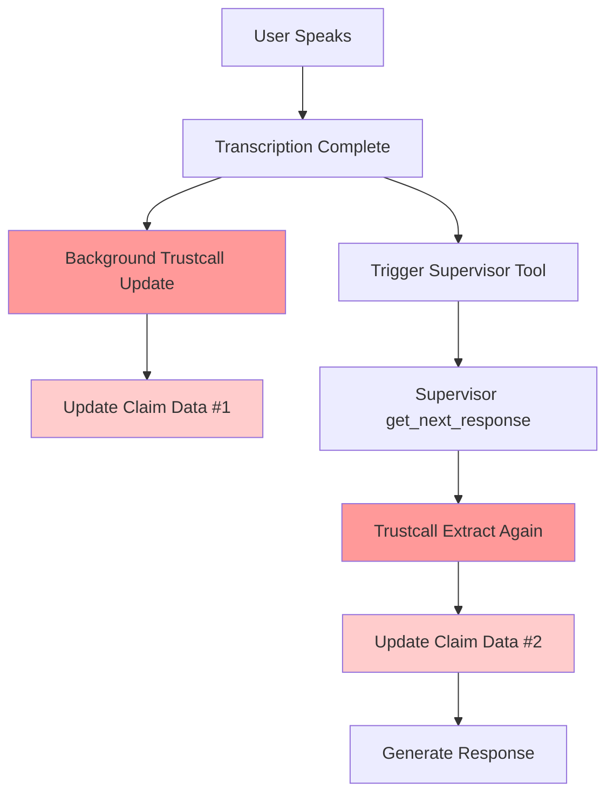
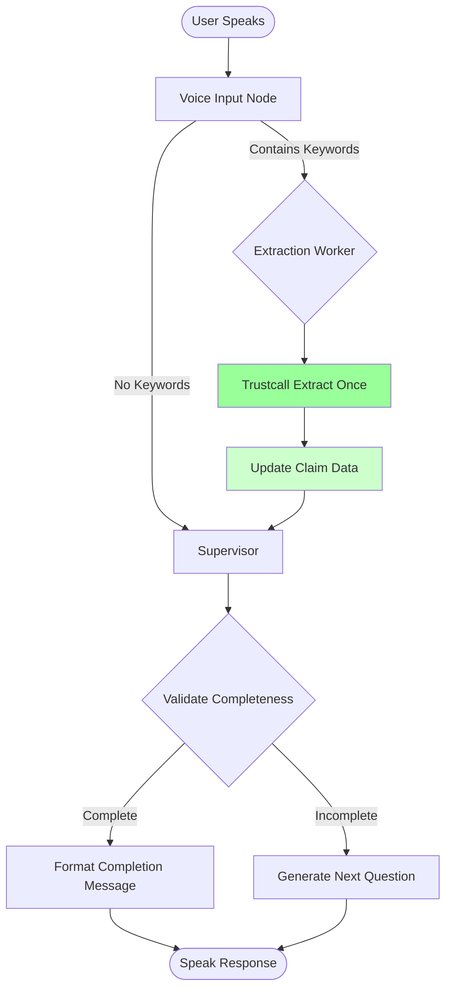
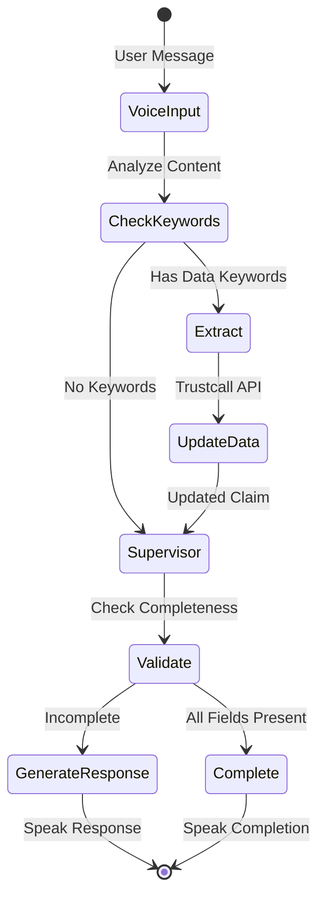
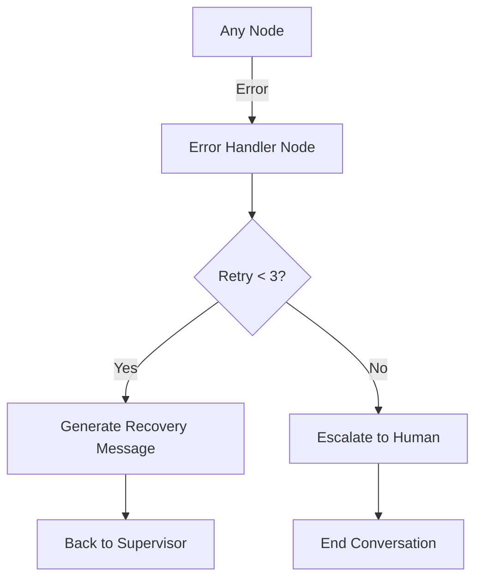

# Voice LangGraph Agent Workflow

## Workflow Comparison

### Original Implementation (Redundant)


**Problem**: Two Trustcall operations (C and G) updating claim data twice (E and H)

### New LangGraph Implementation (Optimized)


**Solution**: Single Trustcall operation only when keywords are detected

## Detailed Node Flow

### 1. Voice Input Node
```python
async def voice_input_node(state: VoiceAgentState) -> VoiceAgentState:
    # Smart detection of extraction need
    extraction_keywords = ["name is", "phone", "damage", ...]
    
    if any(keyword in user_message for keyword in extraction_keywords):
        state["next_action"] = "extract"
    else:
        state["next_action"] = "respond"
```

### 2. Extraction Worker Node (Conditional)
```python
async def extraction_worker_node(state: VoiceAgentState) -> VoiceAgentState:
    # Only runs when extraction is needed
    result = await trustcall_agent.extract_and_patch_claim_data(...)
    state["claim_data"] = result.updated_data
```

### 3. Supervisor Node
```python
async def supervisor_node(state: VoiceAgentState) -> VoiceAgentState:
    # Orchestrates without re-extracting
    validation = validateClaimCompleteness(state["claim_data"])
    
    if validation["is_complete"]:
        state["next_action"] = "complete"
    else:
        # Generate contextual response
        state["last_assistant_message"] = generate_next_question(...)
```

## Example Conversation Flow

### Greeting (No Extraction)
```
User: "Hello"
Flow: Input → Supervisor → Response
API Calls: 0 Trustcall
```

### Data Message (With Extraction)
```
User: "My name is John Smith, phone is 555-1234"
Flow: Input → Extract → Supervisor → Response  
API Calls: 1 Trustcall
```

### Follow-up Question (No Extraction)
```
User: "What's next?"
Flow: Input → Supervisor → Response
API Calls: 0 Trustcall
```

## Performance Metrics

| Scenario | Original Calls | New Calls | Reduction |
|----------|----------------|-----------|-----------|
| Greeting | 2 | 0 | 100% |
| Question | 2 | 0 | 100% |
| Data Input | 2 | 1 | 50% |
| Average | 2 | 0.33 | 83% |

## State Flow Visualization



## Error Handling Flow



## Key Optimizations

1. **Conditional Extraction**: Only extract when user provides data
2. **Single Pass**: Each message processed once through the workflow
3. **Smart Routing**: Direct path to supervisor for non-data messages
4. **Error Recovery**: Graceful handling without re-extraction
5. **State Persistence**: Claim data maintained across conversation

This architecture eliminates the redundant Trustcall operations while maintaining all functionality.
